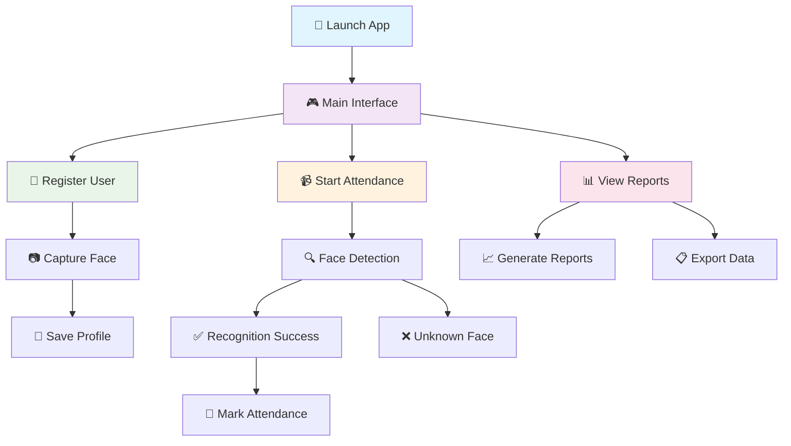
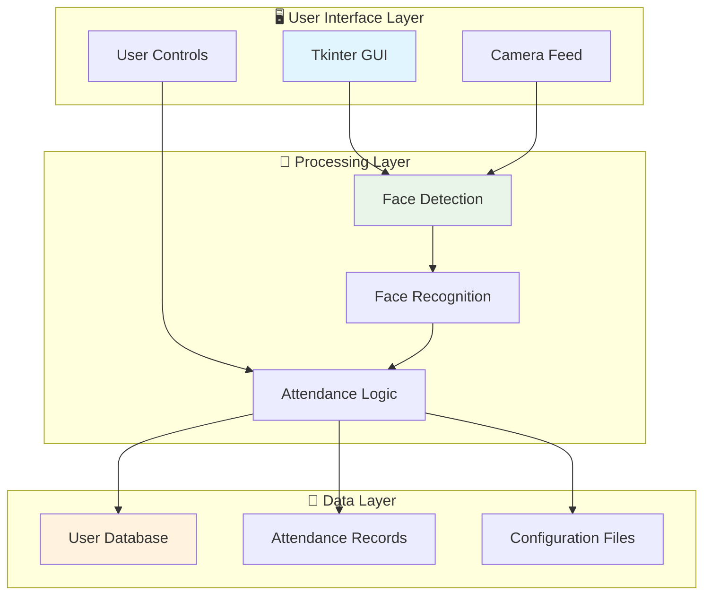
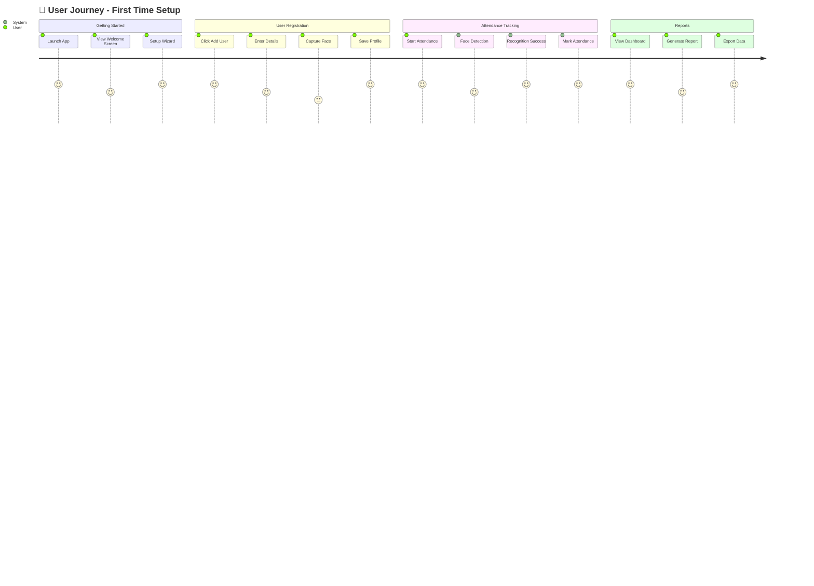
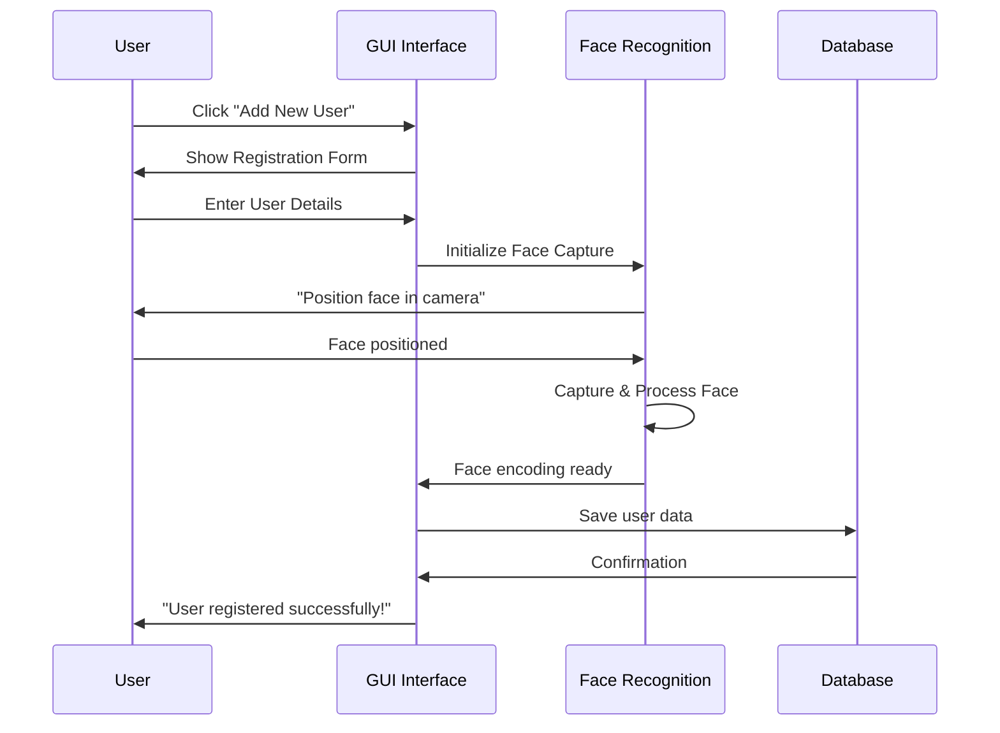

# 🎯 Facial Attendance System with GUI

<div align="center">


[](https://www.python.org/)
[](https://opencv.org/)
[](https://docs.python.org/3/library/tkinter.html)
[](https://github.com/ageitgey/face_recognition)

[](https://github.com/anasraheemdev/facial-attendance-with-gui/stargazers)
[](https://github.com/anasraheemdev/facial-attendance-with-gui/network/members)
[](https://github.com/anasraheemdev/facial-attendance-with-gui/issues)
[](https://github.com/anasraheemdev/facial-attendance-with-gui/blob/main/LICENSE)

🚀 **A modern Facial Attendance System built with Python and Tkinter that uses computer vision to automatically track attendance through facial recognition technology.**

[🎮 Try Demo](#-usage) • [📖 Documentation](#-features-overview) • [🛠️ Installation](#-installation) • [🤝 Contributing](#-contributing) • [⭐ Star](#-facial-attendance-system-with-gui)

</div>

---

## 🌟 Features Showcase

<div align="center">


</div>

<table>
<tr>
<td>

### 🖥️ **Intuitive GUI Interface**
- ✅ User-friendly Tkinter design
- ✅ Responsive layout
- ✅ Modern visual elements
- ✅ Easy navigation
- ✅ Multi-window support

</td>
<td>

### 👤 **Advanced Face Recognition**
- ✅ Real-time face detection
- ✅ High accuracy recognition
- ✅ Multiple face encoding
- ✅ Anti-spoofing measures
- ✅ Low-light performance

</td>
</tr>
<tr>
<td>

### 📊 **Smart Attendance Tracking**
- ✅ Automatic timestamp logging
- ✅ Duplicate entry prevention
- ✅ Attendance history
- ✅ Real-time notifications
- ✅ Customizable time ranges

</td>
<td>

### 💾 **Robust Data Management**
- ✅ Secure data storage
- ✅ Backup & recovery
- ✅ Data encryption
- ✅ Export capabilities
- ✅ Database optimization

</td>
</tr>
</table>

---

## 🔥 Live Demo & Screenshots

<div align="center">

### 🎬 **Application Flow**



</div>

<details>
<summary>📸 <strong>Click to view application screenshots</strong></summary>

### 🏠 **Main Interface**
```
┌─────────────────────────────────────────────────────────┐
│  🎯 Facial Attendance System                           │
│  ═══════════════════════════════════════════════════   │
│                                                         │
│  👤 [👥 Register New User]    📊 [📈 View Reports]     │
│                                                         │
│  📹 [🎥 Start Attendance]     ⚙️ [🔧 Settings]         │
│                                                         │
│  📋 Recent Activity:                                    │
│  ├─ ✅ John Doe - 09:15 AM                             │
│  ├─ ✅ Jane Smith - 09:20 AM                           │
│  └─ ✅ Mike Johnson - 09:25 AM                         │
│                                                         │
│  Status: 🟢 System Ready                               │
└─────────────────────────────────────────────────────────┘
```

### 👤 **User Registration**
```
┌─────────────────────────────────────────────────────────┐
│  👤 Register New User                                   │
│  ═══════════════════════════════════════════════════   │
│                                                         │
│  📝 Name: [John Doe____________]                       │
│  🆔 ID:   [EMP001_____________]                        │
│  📧 Email:[john@example.com___]                        │
│                                                         │
│  📷 Face Capture:                                       │
│  ┌─────────────────────┐                               │
│  │                     │  📊 Samples: 3/5              │
│  │   [Live Camera]     │  ✅ Front View                │
│  │                     │  ✅ Left Profile              │
│  │                     │  🔄 Right Profile             │
│  └─────────────────────┘                               │
│                                                         │
│  [📷 Capture] [💾 Save] [❌ Cancel]                    │
└─────────────────────────────────────────────────────────┘
```

### 📊 **Attendance Dashboard**
```
┌─────────────────────────────────────────────────────────┐
│  📊 Attendance Dashboard                                │
│  ═══════════════════════════════════════════════════   │
│                                                         │
│  📅 Date: May 28, 2025    👥 Total Users: 25          │
│  ✅ Present: 18           ❌ Absent: 7                 │
│                                                         │
│  📈 Today's Activity:                                   │
│  ┌─────────────────────────────────────────────────────┐
│  │ Name          │ Time     │ Status    │ Photo       │
│  ├─────────────────────────────────────────────────────┤
│  │ John Doe      │ 09:15 AM │ ✅ Present │ [👤]        │
│  │ Jane Smith    │ 09:20 AM │ ✅ Present │ [👤]        │
│  │ Mike Johnson  │ 09:25 AM │ ✅ Present │ [👤]        │
│  └─────────────────────────────────────────────────────┘
│                                                         │
│  [📊 Export] [🔍 Filter] [📧 Email Report]            │
└─────────────────────────────────────────────────────────┘
```

</details>

---

## 🛠️ Technology Stack & Architecture

<div align="center">

| Layer | Technology | Version | Purpose | Status |
|-------|------------|---------|---------|--------|
| 🖥️ **Frontend** |  | Latest | GUI Framework | ✅ Active |
| 🧠 **AI/ML** |  | 4.8.1 | Computer Vision | ✅ Active |
| 👤 **Recognition** |  | 1.3.0 | Facial Recognition | ✅ Active |
| 🔢 **Computing** |  | 1.24.3 | Numerical Operations | ✅ Active |
| 📊 **Data** |  | 2.0.3 | Data Management | ✅ Active |
| 🖼️ **Images** |  | 10.0.0 | Image Processing | ✅ Active |
| 🔧 **Core** |  | 3.7+ | Programming Language | ✅ Active |

</div>

### 🏗️ **System Architecture**

<div align="center">



</div>

---

## 📁 Project Structure Deep Dive

<details>
<summary>🔍 <strong>Click to explore project structure</strong></summary>

```
🎯 facial-attendance-with-gui/
├── 📂 assets/                          # 🎨 Static assets
│   ├── 📁 images/                      # UI images
├── 📂 data/                            # 💾 Data storage
│   ├── 📁 attendance/                  # 📊 Attendance records
│   │   ├── 📄 daily_records.csv        # Daily attendance
│   │   ├── 📄 monthly_summary.csv      # Monthly reports
│   │   └── 📄 yearly_stats.csv         # Annual statistics
│   ├── 📁 users/                       # 👥 User profiles
│   │   ├── 📁 profiles/                # User data files
│   │   ├── 📁 images/                  # Profile pictures
│   │   └── 📁 encodings/               # Face encodings
│   └── 📁 backups/                     # 🔄 Data backups
├── 📄 app.py                           # 🚀 Main application
└── 📄 README.md                        # 📖 This file
```

</details>

---

## 🚀 Installation & Setup

### 📋 **System Requirements**

<div align="center">

| Component | Minimum | Recommended |
|-----------|---------|-------------|
| 🖥️ **OS** | Windows 10 / macOS 10.15 / Ubuntu 18.04 | Latest versions |
| 🐍 **Python** | 3.7+ | 3.9+ |
| 💾 **RAM** | 4GB | 8GB+ |
| 💿 **Storage** | 2GB free space | 5GB+ |
| 📹 **Camera** | Any USB/Built-in camera | HD webcam |
| 🔧 **GPU** | Not required | CUDA-compatible (optional) |

</div>

### 🎯 **Quick Start Guide**

<details>
<summary>🚀 <strong>One-Click Installation Script</strong></summary>

#### Windows PowerShell
```powershell
# 📥 Download and run installation script
iwr -useb https://raw.githubusercontent.com/anasraheemdev/facial-attendance-with-gui/main/install.ps1 | iex
```

#### macOS/Linux Terminal
```bash
# 📥 Download and run installation script
curl -fsSL https://raw.githubusercontent.com/anasraheemdev/facial-attendance-with-gui/main/install.sh | bash
```

</details>

<details>
<summary>🔧 <strong>Manual Installation Steps</strong></summary>

#### 1️⃣ **Clone Repository**
```bash
# 📥 Clone the repository
git clone https://github.com/anasraheemdev/facial-attendance-with-gui.git
cd facial-attendance-with-gui

# 📊 Verify download
ls -la
```

#### 2️⃣ **Setup Python Environment**
```bash
# 🐍 Check Python version
python --version

# 🏠 Create virtual environment
python -m venv facial_attendance_env

# 🔄 Activate virtual environment
# Windows:
facial_attendance_env\Scripts\activate
# macOS/Linux:
source facial_attendance_env/bin/activate
```

#### 3️⃣ **Install Dependencies**
```bash
# 📦 Upgrade pip
pip install --upgrade pip

# 📋 Install requirements
pip install -r requirements.txt

# 🔍 Verify installation
pip list
```

#### 4️⃣ **Configure Application**
```bash
# ⚙️ Copy configuration template
cp config.ini.template config.ini

# 📝 Edit configuration (optional)
# nano config.ini  # Linux/macOS
# notepad config.ini  # Windows
```

#### 5️⃣ **Launch Application**
```bash
# 🚀 Run the application
python app.py

# 🎉 Success! Application should open
```

</details>

---

## 📋 Dependencies & Requirements

<div align="center">

### 🔧 **Core Dependencies**

| Package | Version | Purpose | Installation |
|---------|---------|---------|--------------|
| `opencv-python` | 4.8.1.78 | Computer Vision |  |
| `face-recognition` | 1.3.0 | Face Recognition |  |
| `numpy` | 1.24.3 | Numerical Computing |  |
| `pandas` | 2.0.3 | Data Analysis |  |
| `Pillow` | 10.0.0 | Image Processing |  |
| `dlib` | 19.24.2 | Machine Learning |  |

</div>

<details>
<summary>📄 <strong>Complete requirements.txt</strong></summary>

```txt
# 🧠 Core AI/ML Libraries
opencv-python==4.8.1.78
face-recognition==1.3.0
dlib==19.24.2
numpy==1.24.3

# 📊 Data Processing
pandas==2.0.3
openpyxl==3.1.2
xlsxwriter==3.1.2

# 🖼️ Image Processing
Pillow==10.0.0
scikit-image==0.21.0

# 🖥️ GUI Framework
tk==0.1.0
tkinter-tooltip==2.0.1
customtkinter==5.2.0

# 🔧 Utilities
python-dotenv==1.0.0
configparser==6.0.1
datetime==5.2
pathlib==1.0.1

# 📊 Visualization
matplotlib==3.7.2
seaborn==0.12.2

# 🔒 Security
cryptography==41.0.3
hashlib==20081119

# 📝 Logging
logging==0.4.9.6
colorlog==6.7.0

# 🧪 Testing (Development)
pytest==7.4.0
pytest-cov==4.1.0
```

</details>

---

## 🎮 Usage Guide

### 🌟 **Interactive Tutorial**

<div align="center">



</div>

<details>
<summary>🎬 <strong>Step-by-Step Video Tutorial</strong></summary>

### 🎥 **Demo Videos**

| Feature | Duration | Link |
|---------|----------|------|
| 🚀 **Quick Start** | 2 min | [](https://youtube.com/watch?v=demo1) |
| 👤 **User Registration** | 3 min | [](https://youtube.com/watch?v=demo2) |
| 📊 **Attendance Tracking** | 4 min | [](https://youtube.com/watch?v=demo3) |
| 📈 **Reports & Analytics** | 3 min | [](https://youtube.com/watch?v=demo4) |

</details>

### 🎯 **Core Features Walkthrough**

<details>
<summary>🚀 <strong>1. Launch & Setup</strong></summary>

#### **Initial Launch**
```python
# 🚀 Start the application
python app.py

# 🔧 First-time setup wizard will guide you through:
# ├─ 📹 Camera configuration
# ├─ 📁 Data directory setup  
# ├─ ⚙️ Recognition settings
# └─ 👤 Admin user creation
```

#### **Configuration Options**
```ini
[CAMERA]
camera_index = 0
resolution_width = 640
resolution_height = 480
fps = 30

[RECOGNITION]
tolerance = 0.6
model = hog
face_locations = 1

[DATABASE]
backup_enabled = true
backup_interval = 24
max_backups = 30
```

</details>

<details>
<summary>👤 <strong>2. User Registration Process</strong></summary>

#### **Registration Workflow**


#### **Best Practices for Face Registration**
- 📸 **Multiple Angles**: Capture 5+ images from different angles
- 💡 **Good Lighting**: Ensure adequate, even lighting
- 😐 **Neutral Expression**: Use natural, neutral facial expression
- 👓 **With/Without Glasses**: Register both if applicable
- 🔄 **Regular Updates**: Re-register every 6-12 months

</details>

<details>
<summary>📊 <strong>3. Attendance Tracking</strong></summary>

#### **Real-time Attendance Process**
```python
# 🎥 Attendance tracking workflow
def attendance_process():
    # 1. Initialize camera
    camera = initialize_camera()
    
    # 2. Start face detection loop
    while True:
        frame = capture_frame(camera)
        faces = detect_faces(frame)
        
        for face in faces:
            # 3. Recognize face
            identity = recognize_face(face)
            
            if identity:
                # 4. Check if already marked today
                if not already_marked_today(identity):
                    # 5. Mark attendance
                    mark_attendance(identity)
                    show_success_notification(identity)
                else:
                    show_info("Already marked today")
            else:
                show_warning("Unknown face detected")
```

#### **Attendance Rules**
- ✅ **One entry per day** per user
- ⏰ **Configurable time windows** (e.g., 8 AM - 6 PM)
- 🔄 **Grace period** for late arrivals
- 📸 **Photo capture** for verification
- 🚫 **Anti-spoofing** measures

</details>

<details>
<summary>📈 <strong>4. Reports & Analytics</strong></summary>

#### **Available Reports**
```python
# 📊 Report types available
report_types = {
    'daily': {
        'description': 'Daily attendance summary',
        'formats': ['PDF', 'Excel', 'CSV'],
        'charts': ['Pie chart', 'Bar chart']
    },
    'weekly': {
        'description': 'Weekly attendance analysis',
        'formats': ['PDF', 'Excel'],
        'charts': ['Line chart', 'Heatmap']
    },
    'monthly': {
        'description': 'Monthly attendance report',
        'formats': ['PDF', 'Excel'],
        'charts': ['Trend analysis', 'Comparison']
    },
    'custom': {
        'description': 'Custom date range report',
        'formats': ['All formats'],
        'charts': ['All chart types']
    }
}
```

#### **Export Options**
- 📄 **PDF Reports**: Professional formatted reports
- 📊 **Excel Files**: Detailed data with charts
- 📋 **CSV Data**: Raw data for external analysis
- 📧 **Email Reports**: Automated email delivery
- ☁️ **Cloud Sync**: Upload to cloud storage

</details>

---

## 🔧 Configuration & Customization

### ⚙️ **Advanced Settings**

<details>
<summary>🎨 <strong>UI Customization</strong></summary>

#### **Theme Configuration**
```python
# 🎨 Available themes
themes = {
    'default': {
        'primary_color': '#2196F3',
        'secondary_color': '#FFC107',
        'background': '#FFFFFF',
        'text_color': '#000000'
    },
    'dark': {
        'primary_color': '#1976D2',
        'secondary_color': '#FF9800',
        'background': '#121212',
        'text_color': '#FFFFFF'
    },
    'corporate': {
        'primary_color': '#0D47A1',
        'secondary_color': '#FF5722',
        'background': '#F5F5F5',
        'text_color': '#212121'
    }
}
```

#### **Layout Options**
- 📱 **Compact Mode**: Minimal interface
- 🖥️ **Full Screen**: Maximum workspace
- 🔄 **Auto-resize**: Responsive layout
- 🎯 **Custom Layouts**: User-defined arrangements

</details>

<details>
<summary>🧠 <strong>Recognition Settings</strong></summary>

#### **Performance Tuning**
```python
# 🎯 Recognition parameters
recognition_config = {
    'tolerance': 0.6,          # Lower = more strict
    'model': 'hog',            # 'hog' or 'cnn'
    'face_locations': 1,       # Max faces per frame
    'num_jitters': 1,          # Encoding samples
    'face_encodings': 'high'   # Quality level
}

# 🚀 Performance optimization
performance_config = {
    'frame_skip': 2,           # Process every nth frame
    'resize_factor': 0.5,      # Resize frames for speed
    'threading': True,         # Multi-threading
    'gpu_acceleration': False  # CUDA support
}

## 🐛 Troubleshooting & FAQ

### 🔧 **Common Issues & Solutions**

<details>
<summary>❓ <strong>Installation Problems</strong></summary>

#### **Issue: dlib installation fails**
```bash
# 🔨 Solution 1: Install build tools
# Windows:
# Download Visual Studio Build Tools
# Install C++ build tools

# macOS:
xcode-select --install

# Linux:
sudo apt-get install build-essential cmake
```

#### **Issue: Camera not detected**
```python
# 🔍 Solution: Check camera index
import cv2

# Test different camera indices
for i in range(5):
    cap = cv2.VideoCapture(i)
    if cap.read()[0]:
        print(f"Camera found at index {i}")
        cap.release()
```

#### **Issue: Face recognition accuracy low**
```python
# 🎯 Solution: Improve training data
tips = [
    "📸 Use high-quality images",
    "💡 Ensure good lighting",
    "😐 Capture multiple expressions",
    "📐 Include different angles",
    "🔄 Re-train periodically"
]
```

</details>

## 🐛 Troubleshooting

### Common Issues

1. **Camera not working**
   - Check camera permissions
   - Try different camera index (0, 1, 2...)
   - Ensure camera is not used by other applications

2. **Recognition accuracy low**
   - Ensure good lighting conditions
   - Register multiple face angles
   - Adjust recognition threshold

3. **Installation errors**
   - Update pip: `pip install --upgrade pip`
   - Install Microsoft Visual C++ Build Tools (Windows)
   - Use conda for dlib installation if pip fails

## 🙏 Acknowledgments

- OpenCV community for computer vision tools
- face_recognition library developers
- Tkinter for GUI framework
- All contributors and testers

## 🔮 Future Enhancements

- [ ] Web-based interface
- [ ] Mobile app integration
- [ ] Advanced analytics dashboard
- [ ] Multi-camera support
- [ ] Cloud storage integration
- [ ] Real-time notifications

### 🔄 **Contribution Process**

```mermaid
gitgraph
    commit id: "🍴 Fork Repository"
    branch feature-branch
    checkout feature-branch
    commit id: "✨ Add New Feature"
    commit id: "🧪 Add Tests"
    commit id: "📝 Update Docs"
    checkout main
    merge feature-branch
    commit id: "🎉 Feature Merged!"
```

---

## 👨‍💻 Meet the Developer

<div align="center">


### **Anas Raheem** 🚀
*Full-Stack Developer & Software Engineer*

[](https://github.com/anasraheemdev)
[](https://linkedin.com/in/anasraheemdev)
[](https://anasraheemdev.github.io)
[](mailto:anasraheemdev@gmail.com)

*"Building efficient solutions for complex business problems"*

</div>

---

## 📞 Support & Community

<div align="center">

### 🤝 **Get Help**

| Platform | Purpose | Link |
|----------|---------|------|
| 🐛 **GitHub Issues** | Bug reports & Feature requests | [](https://github.com/anasraheemdev/Inventory-Management-C-/issues) |
| 💬 **Discussions** | Community support & Q&A | [](https://github.com/anasraheemdev/Inventory-Management-C-/discussions) |
| 📧 **Email Support** | Direct developer contact | [](mailto:anasraheemdev@gmail.com) |
| 📖 **Documentation** | Comprehensive guides | [](https://github.com/anasraheemdev/Inventory-Management-C-/wiki) |

### 📊 **Project Statistics**


</div>

---

## 📄 License

<div align="center">

This project is licensed under the **MIT License** - see the [LICENSE](LICENSE) file for details.

[](https://opensource.org/licenses/MIT)

*Free to use, modify, and distribute for personal and commercial projects*

</div>

---

<div align="center">

## 🌟 **Show Your Support**

**If this project helped you, please consider:**

[](https://github.com/anasraheemdev/Inventory-Management-C-/stargazers)
[](https://github.com/anasraheemdev/Inventory-Management-C-/fork)
[](https://github.com/anasraheemdev)

---

### 💝 **Thank you for your interest in our Inventory Management System!**


*Made with ❤️ by [Anas Raheem](https://github.com/anasraheemdev)*

</div>


